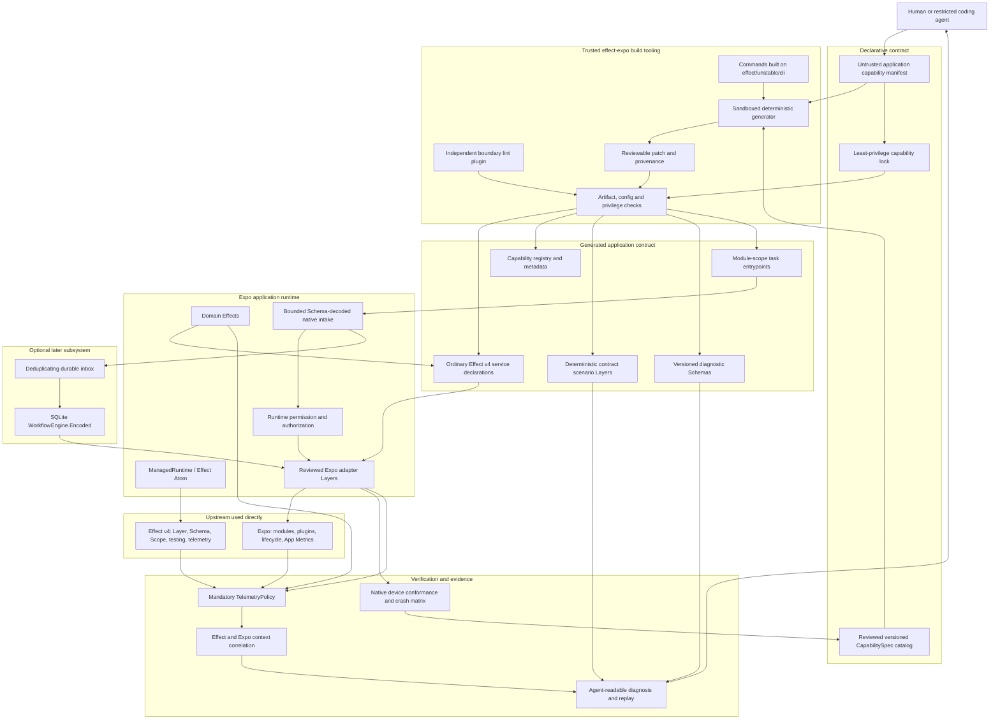

# `effect-expo` architecture

Status: corrected shared understanding after architecture, product red-team, and security audits

Research baseline: Effect `4.0.0-beta.102` (`de2a9a690999`) and Expo `57.0.9` (`534c99966e34`)

This document is the sole architectural source of truth. It incorporates the results of independent source, product red-team, and security reviews.

## Thesis

> **`effect-expo` is an agent-verifiable Effect v4 platform that accounts for the public Expo SDK and progressively supplies explicit contracts, enforced development boundaries, deterministic scenarios, native conformance evidence, and correlated diagnostics.**

Every public Expo SDK package belongs in the versioned catalog. Catalog inclusion does not imply that every React component needs an Effect wrapper: async capabilities, event sources, permissions, persistence, background entrypoints, UI modules, build plugins, tooling, and deprecated APIs receive different reviewed treatments. Coverage is measured per operation and platform, not by package presence alone.

The project does not make arbitrary AI-generated JavaScript safe. TypeScript, Layers, lint rules, and generated files are not a sandbox. They create a strong, reviewable path for cooperative human and agent authors. Actual security boundaries remain OS permissions, runtime authorization, cryptography, trusted CI, code review, and server-side enforcement.

The product is the closed verification loop:

```text
declare -> generate -> compile -> check -> simulate -> observe -> diagnose -> repair -> replay
```

If the project produces only Promise wrappers, spans, lint rules, or a starter, it is useful packaging rather than a differentiated platform.

## Product principle: executable knowledge

The project converts mobile domain knowledge that would otherwise live in reviewers' heads into reusable infrastructure. One reviewed capability specification distributes the same knowledge through generated services, documentation, `AGENTS.md` or skills, types, Schema, lint policy, native configuration checks, deterministic scenarios, device conformance vectors, and structured diagnostics.

The compounding goal is that a defect discovered once becomes a permanent rule, scenario, classification, or conformance case for every future human and coding agent:

```text
maintainer knowledge -> CapabilitySpec -> guidance + enforcement + tests
-> contributor implementation -> structured evidence -> repair and replay
-> new rule, scenario, classification, or conformance case
```

Different encodings have different authority. Documentation and agent instructions guide behavior; types, Schema, lint, and CI verify cooperative code; device conformance calibrates the model; OS permissions, cryptography, runtime authorization, trusted CI, and server policy enforce actual security boundaries.

## Ownership boundary

| Owner         | Responsibilities                                                                                                                                                                                                  |
| ------------- | ----------------------------------------------------------------------------------------------------------------------------------------------------------------------------------------------------------------- |
| Effect v4     | `Effect`, `Layer`, `Schema`, `ManagedRuntime`, scopes, Atom, testing, tracing, metrics, DevTools, CLI primitives, persistence, and workflow APIs                                                                  |
| Expo          | Native modules, config plugins, permissions, native entrypoints, App Metrics, EAS, and development builds                                                                                                         |
| `effect-expo` | Verified capability semantics, generated declarations and metadata, reviewed Expo adapter Layers, policy enforcement, contract scenarios, native conformance suites, telemetry correlation, and typed diagnostics |

`effect-expo` must not create a competing runtime, React provider, Workflow/Activity DSL, telemetry protocol, config-plugin system, or local-first event model.

## Repository boundaries

The repository is a Bun workspace. Packages are created only when they own working code and an independently meaningful boundary:

```text
apps/
└── test-suite/         # Expo/Metro live conformance and interactive evidence
evals/
└── agent/              # Seeded agent tasks, controls, and result protocol
packages/
├── catalog/            # Generated SDK inventory and authored operation coverage
├── core/               # Closed shared contracts and diagnostics
├── network/            # Public Network runtime, Expo adapter, and test Layer
├── cli/                # Trusted generators and read-only verification commands
└── typescript-config/  # Shared TypeScript and Effect LSP policy
```

Capability packages own application-visible contracts, reviewed production adapters, and deterministic test Layers. Trusted generation and checking remain in the CLI/build-tooling package rather than becoming part of a runtime package. `vendor/effect` and `vendor/expo` are research-only Git submodules and are not Bun workspaces or publishable dependencies.

The catalog universe is generated from pinned Expo-owned public package manifests and Expo-owned entries in `bundledNativeModules.json`; third-party React Native dependencies bundled for compatibility are outside this Expo-capability denominator. Documentation enriches entries but does not silently determine membership. Every Expo-owned candidate is included or explicitly excluded with a reason. Its matrix separates discovery, classification, operation inventory, adaptation, deterministic scenarios, native platform conformance, and agent evaluation. A generated entry or successful bundle never grants a `verified` status.

Testing remains a subpath export of each capability until independent versioning or dependency weight justifies a separate testing package. Empty speculative packages such as an ESLint plugin or example application are not created in advance.

## Target sources of truth

The target architecture has two declarative inputs and one trusted implementation layer. The Network prototype currently implements only the reviewed capability specification and production adapter portions described below; the application manifest and capability lock are planned.

### Verified capability specifications

A mature versioned `CapabilitySpec` catalog maintained and reviewed by `effect-expo` will record:

- capability and operation identifiers;
- Effect service shape and Schema-backed success/error contracts;
- foreground and headless execution restrictions;
- native package and configuration requirements;
- privacy classification for every diagnostic, persisted, and telemetry field;
- deterministic scenario state machines;
- native conformance vectors;
- supported Effect, Expo, iOS, and Android ranges.

The specification is declarative data validated by a closed Schema. It cannot contain executable hooks, shell fragments, arbitrary module paths, SQL, config plugins, or templates that execute code.

### Application capability manifest

Each application will explicitly select capabilities and supply app policy in a declarative manifest. Capabilities must not be inferred from arbitrary Layers or imports. The manifest will be treated as untrusted build input.

Selection will produce a checked-in capability lock containing exact native permissions, entitlements, background modes, adapters, versions, and human justification. Checks must fail for missing **and surplus** privilege.

### Reviewed production adapters

Generation handles declarations, registries, metadata, diagnostics, and repetitive plumbing. Production Expo adapters and native error classification remain hand-authored and reviewed. Generated code cannot infer truthful mobile semantics from Expo TypeScript declarations alone.

Generated application code imports Effect v4 APIs directly. `effect-expo` does not re-export or stabilize experimental Effect APIs behind a facade.

## Generated artifacts

The current prototype generator produces fixed, checked-in Network declarations, Network matrix metadata, and the Expo catalog. It validates canonical workspace containment, rejects symbolic-link output paths, writes through same-directory temporary files, atomically renames completed output, and treats missing output as stable generated drift.

The target generator will additionally produce, from specifications and an application manifest:

```text
Effect v4 service declarations
application capability registry
Schema-backed diagnostic and error types
production Layer wiring
deterministic scenario Layers
native configuration requirements
telemetry and persistence classifications
lint policy metadata
module-scope task entrypoint declarations
documentation and provenance
```

Every mature artifact must record the spec version, generator version, adapter version, and supported upstream range. The current prototype records source provenance for the Expo catalog but does not yet carry all four fields on every generated Network artifact. Generation is reproducible and checked in CI.

Future application generation must default to an unapplied, reviewable patch. It must run offline with a sanitized environment and cannot install packages, execute lifecycle scripts or config plugins, mutate signing settings, add permissions, or invoke shell commands. Security-sensitive changes require independent approval. These sandbox and application-generation guarantees are design requirements, not claims about the current prototype CLI.

## Target enforcement model

The intended enforcement system is defense in depth, not one mechanism. Only the subset listed later under **Enforcement policy** is implemented in the current prototype.

| Layer               | Enforcement responsibility                                                                                  |
| ------------------- | ----------------------------------------------------------------------------------------------------------- |
| Effect typing       | Missing services and Layer requirements                                                                     |
| Package boundaries  | Application code cannot import adapter internals; Knip rejects dependency and dead-export drift             |
| Lint and trusted CI | Raw guarded Expo imports, generated-file edits, unsafe entrypoints, unmanaged execution, suppression policy |
| Generator check     | Specifications, generated files, versions, and capability lock agree                                        |
| Expo config check   | Required config exists; stale or surplus native privilege is rejected                                       |
| Runtime boundary    | External/native values are bounded and Schema-decoded; authorization and permissions are rechecked          |
| Scenario suite      | Domain behavior handles documented failures                                                                 |
| Device conformance  | Production adapter matches the reviewed contract on supported platforms                                     |
| Release scan        | Test Layers, development endpoints, database devtools, and sensitive fixtures are absent                    |

Lint rules focus on high-confidence source boundaries. Missing native config belongs to the config checker; invalid values belong to Schema; lifecycle and failure behavior belong to scenario/conformance tests.

Approved exceptions require an owner, reason, narrow scope, and expiry. “Agent-verifiable” means the trusted build rejects unapproved violations by default.

## Deterministic failures and native truth

Deterministic Layers are **contract scenarios**, not an OS emulator. They model application-visible states and transitions using the same generated services as production, with Effect `TestClock` for time.

Testing is divided into three tiers:

1. **Pure contract scenarios** — deterministic state machines for denial, offline state, interruption, expiration, duplicate delivery, corruption, and unavailable modules.
2. **Adapter conformance** — the same observable vectors run against reviewed Expo adapters in development builds.
3. **Lifecycle and crash matrix** — physical-device tests for process death, permission revocation, protected-data availability, background expiration, database recovery, backup/restore, and OTA changes.

Scenario coverage is model coverage, not proof of platform behavior. A capability receives the `verified` label only after its adapter and scenarios pass the supported device matrix.

Effect-returning unit and contract tests use `@effect/vitest` so Scope, TestClock, TestConsole, Cause reporting, and cancellation have one reviewed runner. Pure synchronous tests remain ordinary Vitest tests. Mutable scenario Layers are provided per test; shared `it.layer` blocks are reserved for resources whose cross-test lifetime is explicit. Schema-derived property tests exercise stable invariants at capability-specification and native-intake boundaries, complementing authored examples rather than replacing device conformance.

For iOS development runs, pinned `serve-sim` tooling supplies simulator streaming and operator controls such as normalized taps, permission changes, memory warnings, rotation, and event logs. It is deliberately outside the conformance oracle: `serve-sim` creates and observes conditions, while the shared Effect conformance program emits the typed result. The helper binds to loopback by default and must not be exposed to an untrusted LAN. Exact commands live in the repository README so this architectural document remains the single conceptual source of truth.

## CLI and diagnostics

The CLI uses `effect/unstable/cli` directly. Effect supplies the CLI framework; `effect-expo` owns the command behavior and diagnostic protocol.

Implemented commands:

```text
effect-expo generate
effect-expo check
effect-expo matrix
effect-expo explain --code <diagnostic-code>
```

Scenario execution, native observation, capability selection, and any dedicated lint command remain planned surfaces. They are not aliases for the current `check` or `matrix` commands.

Human and JSON output are renderers over one versioned Schema. JSON uses stable diagnostic codes and bounded structured data; stdout contains protocol output and stderr contains sanitized logs.

`check` is read-only. Mutating fixes are reviewed patches tied to expected file hashes. The CLI never automatically adds permissions, weakens transport or storage security, enables background modes, suppresses policy, executes commands, or follows output paths outside the workspace.

## Enforcement policy

The current trusted checker enforces only rules with a high-confidence syntax or module boundary. Oxlint remains responsible for general source quality. Today `effect-expo check` verifies:

- no guarded raw Expo imports outside reviewed adapters;
- no direct Expo or React Native module-loader access for guarded capabilities;
- no internal package entrypoint imports;
- no Effect v4 runner variants or aliases outside approved entrypoints;
- no test/fake capability subpath imports in production source;
- generated artifacts agree with their declarative or vendored sources, including when an output is missing.

Module-scope TaskManager validation, suppression governance, native configuration checks, and privilege-lock enforcement remain planned rules and must not be presented as active safeguards.

More semantic rules—unbounded retry, discarded native failures, missing scoping, persistence classification, and idempotency—are added only when their false-positive rate is acceptable. Effect's vendored `@effect/oxc` package is private, so it is a design reference rather than a public dependency.

Diagnostics use a versioned JSON envelope and stable codes shared with human output and `explain`. Policy scans exclude dependencies, generated output, tests, and evaluation fixtures so examples of prohibited code cannot trigger production findings.

## Target observability and privacy

Effect already owns spans, Causes, logs, metrics, OTLP, and its DevTools protocol. Expo App Metrics already owns native sessions, crashes, logs, network observations, and native performance signals. The target `effect-expo` platform will correlate these systems and produce repair-oriented diagnostics; the current Network prototype emits bounded Effect spans only and does not yet implement cross-system correlation or a telemetry backend.

In the target platform, every signal must cross a mandatory `TelemetryPolicy` before reaching console output, CLI diagnostics, DevTools, App Metrics, OTLP, or crash bundles. This policy is not yet implemented. It must be deny-by-default and enforce:

- field classification: `public`, `operational`, `personal`, or `secret`;
- allowlisted, low-cardinality attributes;
- URL normalization with credentials, query, and fragments removed;
- bounded bodies, messages, collections, and error summaries;
- no raw notification bodies, coordinates, file contents, SQL values, tokens, full Causes, or native error objects;
- remote export and Effect DevTools disabled in production unless explicitly approved;
- authenticated TLS endpoints, destination allowlists, sampling, retention, consent, and deletion policies when enabled.

Effect `Redacted` prevents common accidental display but is not encryption and does not remove copies already written elsewhere.

The correlation context may contain approved values such as Effect trace/span ID, Expo session ID, update ID, route template, foreground/headless entrypoint, task name/event ID, capability/operation ID, and scenario ID. High-cardinality identifiers do not become metric labels.

## Native events, persistence, and background work

Notifications, deep links, TaskManager payloads, files, network data, persisted rows, and OTA-restored state are untrusted inputs. Each intake boundary applies Schema validation plus byte, depth, collection, and time limits.

For durable native-event acceptance:

```text
validate payload -> authenticate provenance where possible
-> deduplicate -> commit bounded inbox row atomically
-> acknowledge Expo -> re-authorize when processing
```

Expo `eventId` is a deduplication identifier, not authentication. The guarantee is limited to: **once valid work is committed locally, it can be recovered at a later execution opportunity**. A JavaScript TaskManager bridge cannot guarantee delivery before JavaScript receives the event, guaranteed OS wake-up, or exactly-once external effects.

Persist opaque resource identifiers rather than tokens or standing authorization. Sensitive work is re-authorized at execution time. Classified persisted fields require reviewed authenticated encryption with keys protected by SecureStore. Storage has quotas, bounded retry, dead-letter states, versioning, corruption quarantine, logout/account-switch invalidation, and deletion behavior.

## Optional workflow subsystem

A local SQLite implementation of Effect's official `WorkflowEngine.Encoded` remains a credible advanced subsystem. It is not required by the capability compiler, verifier, scenarios, or first product wedge.

It must:

- use Effect's Workflow and Activity APIs directly;
- use immutable versioned workflow identifiers and definition/schema hashes;
- fail closed on missing or mismatched definitions after OTA changes;
- recheck authorization, consent, ownership, and native permission at every sensitive Activity;
- provide at-least-once Activities with external idempotency or compensation;
- encrypt classified persisted fields and reject corrupt/oversized rows;
- pass physical-device tests for transactions, concurrency, leases, migrations, process death, and foreground/headless overlap.

TaskManager and BackgroundTask are optional execution opportunities, not the runtime and not the source of durability.

## Target architecture

The following diagram is the intended end state, not a diagram of packages already implemented by the Network prototype.



## Prototype zero: Network

Before attempting Notifications, build a deliberately small end-to-end Network capability. Its purpose is to assess code style and falsify the basic compiler/adapter/testing architecture cheaply—not to claim that network wrapping alone is innovative.

The Network prototype includes:

- one closed declarative specification;
- one generated ordinary Effect v4 service declaration;
- one hand-authored, scoped `expo-network` adapter;
- total Schema-decoded state and typed contract/native/unavailable failures;
- separate `isConnected` and `isInternetReachable` semantics;
- spans with bounded capability and operation attributes;
- a deterministic state-machine Layer and conformance vectors shared with the live adapter;
- a generated SDK 57 catalog accounting for 132 Expo-owned public-manifest or bundled candidates, with 92 included and 40 explicitly excluded;
- human and JSON capability-matrix output;
- stable diagnostics for raw capability imports, internal imports, unmanaged runtimes, testing imports, and generated drift;
- an Expo Router test-suite app that exports through Metro and runs live vectors;
- versioned agent-evaluation fixtures and comparison metrics;
- `generate`, `check`, `matrix`, and `explain` commands built directly on `effect/unstable/cli`.

Network intentionally has no config plugin, permission request flow, background entrypoint, sensitive payload, or durable execution. Passing this prototype validates implementation conventions only. Its native iOS, Android, and web cells remain unverified until the live vectors run successfully on those platforms. A developer could reproduce its runtime behavior in hours; the differentiator must emerge from the reusable verification loop across the full catalog and harder capabilities.

## First validation wedge

Build one end-to-end **verified Notifications capability** before a workflow engine or broad implementation expansion. The SDK catalog exists first so missing coverage remains measurable; catalog presence is not implementation.

Notifications exercises the central claims:

- permission and permanent-denial states;
- iOS and Android configuration;
- config-plugin verification;
- foreground and background entrypoints;
- module-scope task definitions;
- untrusted payload decoding and duplicate delivery;
- privacy-sensitive telemetry;
- correlated task/session/Effect diagnostics;
- agent repair and deterministic replay.

The wedge includes one reviewed specification, generated Effect service declarations, a hand-authored Expo Layer, contract scenarios, config/privilege checks, high-confidence lint rules, native device conformance, privacy policy, JSON diagnostics, and a comparative agent benchmark.

The architecture is not validated until the benchmark demonstrates that agents using `effect-expo` produce and repair correct notification features materially more reliably than agents using raw Expo.

## Validation and kill criteria

Initial targets:

- at least 30% fewer invalid outcomes than raw Expo over at least 20 independent agent tasks;
- at least 25% fewer repair iterations without a material token-cost increase;
- at least 90% agreement between documented contract scenarios and equivalent device outcomes;
- under 5% config-check false positives, with uncertainty reported explicitly;
- all documented accidental boundary bypasses detected in trusted CI;
- at least three of five design partners retain the verified path after a real feature;
- a verified capability can be updated to a compatible Expo SDK within two maintainer working days.
- a growing automation-conversion rate: repeated defects and review findings become reusable infrastructure rather than permanent reviewer memory;
- a falling knowledge-drift rate: generated guidance, policy, scenarios, native behavior, and diagnostics remain consistent.

Pivot to a smaller `@effect/platform-expo` integration library if the closed loop does not outperform TypeScript, Expo Doctor, ordinary linting, raw Expo diagnostics, and existing telemetry. Keep the full SDK catalog visible, but do not expand implementation broadly, build custom DevTools, or prioritize durable workflows before this proof.

## Agent evaluation protocol

Agent friendliness is measured, not inferred from documentation quality. Each versioned task runs in two conditions: Expo plus Effect without `effect-expo`, and the same task with public `effect-expo` packages, repository guidance, and enforcement. Results record first-attempt verification, architectural violations, successful repair after a diagnostic, tool calls, and human corrections.

Initial fixtures cover raw Expo imports, internal package imports, unmanaged Effect execution, production use of testing Layers, direct edits to generated output, and listener scoping. Static fixtures validate the diagnostic harness; repeated model runs are still required before any agent operation becomes `verified` in the matrix.

## Open decisions

These questions remain deliberately unresolved until native Network conformance and the Notifications wedge provide product evidence:

1. **Capability granularity:** package, permission, operation, or policy bundle.
2. **Error ownership:** how stable typed failures evolve over open-ended Expo `CodedError` values while preserving unknown defects.
3. **Generated-file lifecycle:** whether application artifacts are committed, regenerated, extended, or verified only.
4. **Config proof:** when evaluated Expo config is enough and when compiled native-mod introspection is required.
5. **Enforcement boundary:** which packages may import raw Expo modules and how reviewed exceptions are represented.
6. **Conformance governance:** how simulated transitions are calibrated and versioned against iOS and Android behavior.
7. **Telemetry authority:** which system owns export and sampling while `effect-expo` owns sanitization, correlation, and diagnostic meaning.
8. **Upstream compatibility:** the supported Effect beta and Expo SDK matrix and the policy for breaking experimental APIs.
9. **Storage driver:** whether later durable work standardizes on OP-SQLite, supports `expo-sqlite`, or defines a conformance-tested store boundary.
10. **Workflow OTA policy:** how running definitions are retained, migrated, or failed closed across EAS Updates.

## Source evidence

The ownership and risk boundaries above are grounded in the vendored source:

- Effect [`ManagedRuntime`](../vendor/effect/packages/effect/src/ManagedRuntime.ts#L86-L104) already owns Layer construction, cached context, scope, fibers, and disposal.
- Effect Atom's [`RuntimeFactory`](../vendor/effect/packages/effect/src/unstable/reactivity/Atom.ts#L697-L795) already supplies shared Layer memoization and reactive runtime integration.
- Effect [`TestClock`](../vendor/effect/packages/effect/src/testing/TestClock.ts#L1-L41) supplies deterministic time but not a simulation of native OS behavior.
- Effect [`DevTools`](../vendor/effect/packages/effect/src/unstable/devtools/DevTools.ts#L24-L68) and [`effect/unstable/observability`](../vendor/effect/packages/effect/src/unstable/observability/index.ts) already provide tracing, metrics, and export infrastructure.
- Effect [`effect/unstable/cli`](../vendor/effect/packages/effect/src/unstable/cli/index.ts) already provides the CLI framework.
- Effect's [`WorkflowEngine.Encoded`](../vendor/effect/packages/effect/src/unstable/workflow/WorkflowEngine.ts#L289-L377) is the contract a future local engine should implement directly.
- Expo's [`PermissionResponse`](../vendor/expo/packages/expo-modules-core/src/PermissionsInterface.ts#L1-L42) already represents permission status and requestability.
- Expo [`CodedError`](../vendor/expo/packages/expo-modules-core/src/errors/CodedError.ts#L1-L13) exposes an open string code, so closed typed failure semantics require reviewed ownership.
- Expo [`TaskManager.defineTask`](../vendor/expo/packages/expo-task-manager/src/TaskManager.ts#L101-L137) requires module-scope registration, and task completion is reported in [`finally`](../vendor/expo/packages/expo-task-manager/src/TaskManager.ts#L250-L278).
- Expo [`App Metrics`](../vendor/expo/packages/expo-app-metrics/src/types.ts#L497-L604) already owns native sessions, persisted logs, crashes, metrics, and network observations.
- Expo config plugins are executable functions over configuration ([`ConfigPlugin`](../vendor/expo/packages/@expo/config-plugins/src/Plugin.types.ts#L95-L97)), so application capability selection cannot be inferred safely from arbitrary TypeScript or Layers.
- Effect's current React Native SQL test is only a placeholder ([`Client.test.ts`](../vendor/effect/packages/sql/sqlite-react-native/test/Client.test.ts#L1-L6)), making real-device storage validation a release gate for durable work.

## Current assessment

The prototype now implements the first closed-loop pieces—catalog, matrix, generation checks, boundary diagnostics, deterministic scenarios, a Metro-bundled test app, and eval fixtures—but still lacks native platform evidence and comparative agent runs. It remains an architecture validation rather than a proven product. It can earn approximately **8/10** by demonstrating native conformance and a materially better agent repair rate, and **8.5/10** only after adoption, accumulated device evidence, maintained semantic contracts, and a validated hard subsystem such as local workflows.

The defensible asset is not generated boilerplate. It is the maintained body of verified mobile semantics, security policy, device conformance evidence, failure scenarios, and diagnostics that allow an agent to explain and verify its own correction.
