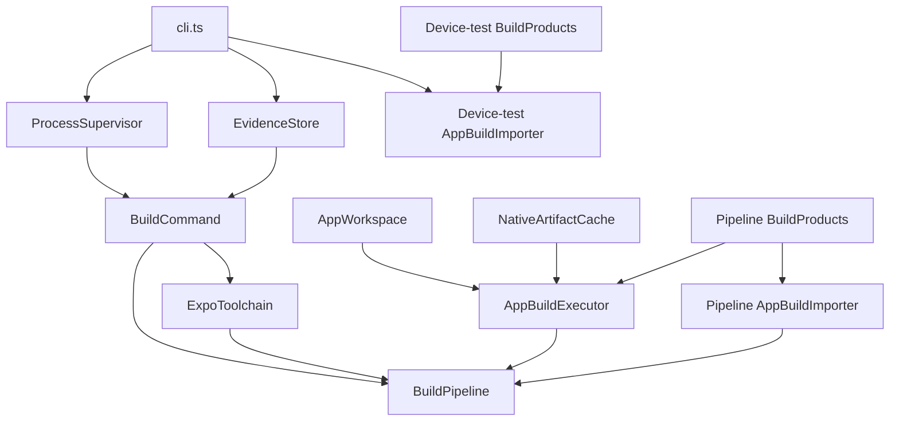
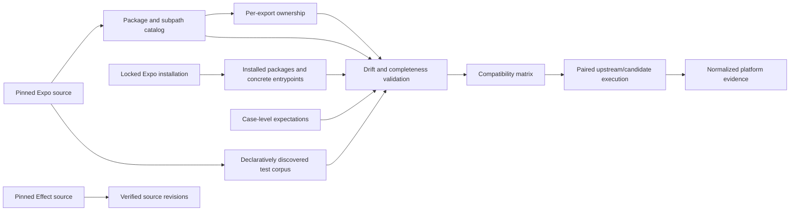
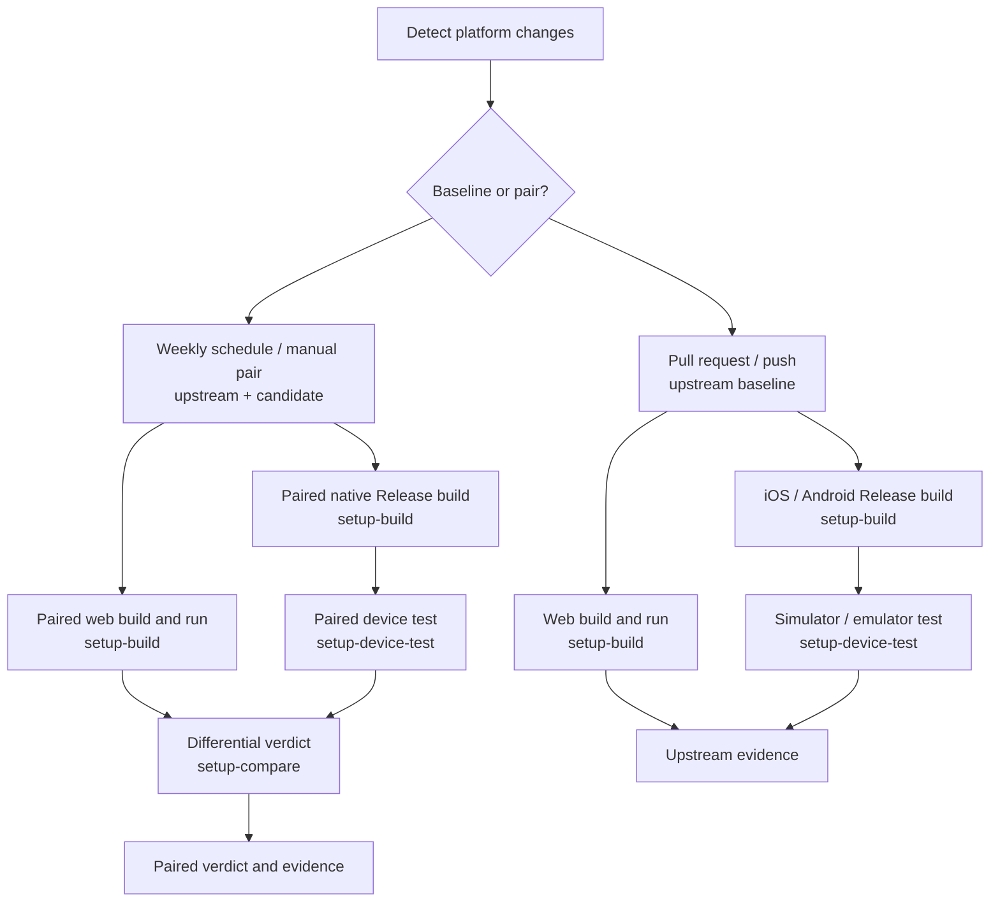
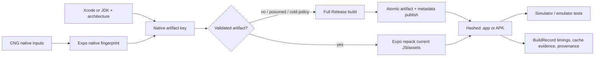

# better-native architecture

## Product contract

better-native exposes two interfaces over the same installed Expo native packages:

```ts
// Existing Expo application code remains valid.
import * as Network from "expo-network"

// Developers may opt into typed Effect services and failures.
import { Network } from "@better-native/network"
```

Candidate mode changes selected JavaScript resolution through Metro. It does not replace Expo autolinking, config plugins, CocoaPods, Gradle, Expo Modules, or EAS tooling.

## Authoritative target

The exact revision in the external Expo source checkout (`../expo` by default, or `EXPO_SOURCE_ROOT`) is the authoritative research target. Its package manifests, exports, source behavior, tests, native registration, and build tooling define the compatibility contract even when a registry package reports the same semantic version.

Published Expo packages are comparison evidence only. They never redefine or fill gaps in an Expo-owned target surface. Installed registry manifests define target entrypoints only for bundled third-party packages that are absent from the pinned Expo workspace.

## Compatibility contract

The test layers, coverage gate, and native-parity evidence standard are defined in
[the testing strategy](./testing.md).

Compatibility covers:

- package and subpath resolution;
- runtime and type exports;
- synchronous throws and Promise failures;
- values, error codes, callbacks, subscriptions, hooks, and cleanup;
- module initialization and side effects;
- config plugins and native registration;
- web, iOS, Android, foreground, background, and headless behavior.

The implementation may be incomplete. The compatibility denominator may not be incomplete. Every known export has an ownership state:

- `effect`: implemented by better-native;
- `upstream`: delegated to the pinned Expo implementation;
- `fallback`: better-native attempts an implementation and deliberately falls back;
- `unsupported`: known and unavailable;
- `intentional-divergence`: behavior differs under an explicit reviewed contract.

Only `effect` counts as migrated.

`compatibility/capabilities.json` declares the common and package-specific work required for each
migration. `bun run migration-status` derives package, documentation, mapping, installation,
compatibility-app, generated-resolution, and DX-eval status from repository files. The strict form
fails when any declared integration is absent. Ownership remains authoritative for promotion, so a
complete checklist with `fallback` ownership is implemented but not migrated.

## Repository boundaries

```text
apps/compatibility-suite       Executable Expo application and live vectors
packages/*                     Publishable better-native packages
tooling/compatibility-harness  Private Expo catalog and installation-validation CLI
tooling/dx-evals               Private Effect-native developer-experience eval harness
tooling/expo-catalog           Private declaration-only fallback for external packages
evals/tasks                    Versioned public DX task fixtures and runtime-withheld controls
packages/typescript-config     Private shared TypeScript presets
compatibility/capabilities.json Reviewed per-capability migration requirements
compatibility/ownership.json   Reviewed per-export ownership overrides
compatibility/api-mappings.json Reviewed Expo-to-Effect semantic API mappings
compatibility/surface-lock.json Reviewed lock for the complete discovered export denominator
compatibility/expectations.json Case-level known upstream or candidate behavior
compatibility/suites.json      Declarative upstream test discovery rules
vendor/effect                  Pinned Effect source
../expo                        External pinned Expo source and behavioral oracle
.artifacts                     Disposable catalogs, reports, builds, logs, and screenshots
```

The compatibility and DX harnesses support different claims. Compatibility measures behavior
against pinned Expo source. DX evals measure task completion through the declared public
better-native boundary; their current synthetic, Network, Battery, KeepAwake, and SecureStore
instruments are implemented. Paid Network and Battery pilot evidence is recorded, while paid
KeepAwake and SecureStore execution, human blind pilots, and calibrated regression thresholds
remain pending. See
[the evaluation contract](./evals.md) for the current checkpoint status and evidence limits.

## Harness configuration

`HarnessConfig` is the single host-side environment boundary. It loads all harness inputs once
with Effect `Config`, applies typed defaults, validates booleans, and keeps the Turbo token
redacted until the child-process environment is assembled. `cli.ts` provides that one Layer to
the repository, toolchain, build, cache, and command services; those services do not read
`process.env` directly.

The `BETTER_NATIVE_MODE`, build/run identity, pinned Expo root, and upstream `node_modules` values
are a separate child-process protocol produced by the build executor. Expo's synchronous app and
Metro configuration consume that protocol at their required Node boundary. Every host input is
listed in `environmentKeys`, and a repository test requires a corresponding entry in
`.env.example`.

## Fixture boundary

The compatibility suite is a runner, not an application that installs the complete Expo SDK. Its
manifest contains the runner's curated source/test dependency closure, not every third-party Expo
package. The Expo catalog and ownership ledger retain every discovered package and export,
including packages that cannot coexist in one native binary.

`AppWorkspace` preserves the source fixture manifest. Its disposable copy receives one generated,
platform-specific Expo Autolinking `searchPaths` entry only after an initial native discovery pass.
That entry points to a narrow overlay containing the discovered native Expo closure from the pinned
checkout. It never points at the repository or complete pinned `node_modules`, because either would
turn unrelated installed native modules into build inputs. Native package coverage is added through
generated single-package or explicitly compatible-cohort fixtures. An upstream failure of such a
fixture is recorded as an upstream result; it is never hidden by omitting the package from the
catalog.

The isolated workspace links every Expo workspace package to its directory in the authoritative
pinned checkout and links declared bundled third-party dependencies to the repository installation.
The initial Expo Autolinking result selects the platform overlay; a second Expo Modules and React
Native Autolinking pass must resolve every known Expo and direct dependency path to that
materialization before CNG runs. This gives CocoaPods and Gradle the same package roots. The app
explicitly enables Expo's `autolinkingModuleResolution` experiment because a disposable workspace is
not detected as a monorepo; Metro therefore consumes the same native module map, while the paired
resolver prioritizes the isolated workspace's `node_modules` for every tracked upstream import. A
Node prebuild assertion also verifies and records every pinned Expo workspace link, so an
identically versioned app-local or repository registry package cannot silently replace pinned
source.

For bundled third-party packages absent from Expo's source tree, declaration extraction reads the
normal installation of the pinned external Expo checkout. When that installation does not
materialize an artifact, the current implementation falls back to the non-native
`tooling/expo-catalog` declaration workspace. The installation report records runner dependencies
separately, so a fixture's dependency set cannot redefine the catalog. Native coverage becomes
blocking only in the generated fixture that declares the relevant package.

The fallback is a private implementation boundary, not a publishable dependency or a second Expo
target. It restores the complete, locked surface denominator without autolinking every third-party
package into the runner. Patched transitive resolutions are enforced at the root and may be
accepted only while regeneration preserves the reviewed surface lock and all compatibility tests
continue to pass.

An execution unit selects exactly one source and names its runner and platform. The harness retains
the complete unit manifest as evidence. Browser runs receive only
`run?runId=<id>&source=<source-id>`. Native device runs receive the equally short
`run?runId=<id>&cohort=native-e2e`; the compiled registry expands that cohort from Expo's active
`apps/bare-expo/e2e/TestSuite-test.native.js` list. The Effect supervisor installs each Release
product once. The generated Maestro flow then clears application state, cold-launches through the
short deep link, and asserts selection and completion exactly as Expo's native suite does. The
supervisor neither pregrants permissions nor prelaunches or cleans up a successful run; it checks
liveness and collects native logs only after a runner failure. This keeps compatibility plans out
of HTTP headers and deep links while retaining case-level results and source-level attribution.
Maestro writes JUnit evidence; a report-grace watchdog accepts a passing report if the pinned
Android Maestro process wedges during shutdown, while the process supervisor still enforces the
hard run timeout and termination escalation.

The fixture carries a reserved synthetic EAS project identity because `expo-observe` requires one
during native initialization. Its root configures Observe with dispatch disabled, so compatibility
measurements never become application telemetry.

The harness source is divided by responsibility:

```text
src/build       Expo toolchain preparation, isolated CNG workspaces, builds, and product import
src/supervision Scoped processes plus web, simulator, emulator, and external-runner lifecycles
src/evidence    Immutable evidence storage and runtime discovery
src/protocol    Cross-process run protocols
src/comparison  Upstream/candidate differential verdicts
src/runners     Upstream runner adapters
```

`BuildPipeline` now only coordinates prepared toolchains with build execution and product import.
It does not install Expo or own process lifecycle behavior.

### Build service ownership

`cli.ts` constructs the shared host-facing `BuildCommand`, `ExpoToolchain`, and evidence services.
`BuildPipeline.layer` receives those services and assembles its pipeline-local workspace, native
artifact cache, executor, product reader, and importer graph. Native run commands also receive a
top-level `AppBuildImporter` so device-test jobs can load immutable products without constructing a
build pipeline or materializing Expo. This keeps the pinned Expo installation behind the one shared
`ExpoToolchain` while allowing build and device-test commands to use different dependency profiles.



External runner plans are executable-code manifests, not untrusted data. Every plan is reviewed
like source code, declares `"reviewed": true`, remains inside the repository, and uses only the
narrow command set associated with its runner. The supervisor confines working directories and
reports to real, non-symlinked repository paths and bounds report ingestion. Reports may only be
written beneath `.artifacts/runs/<run-id>/external`; no plan can replace or remove repository
source files.
`RunnerPlanLedger.json` gives every non-app corpus source either a concrete runner command or an
explicit blocker, so an unsupported runner never disappears from the compatibility denominator.
Jest source classification records AST-derived static, dynamic, or absent case evidence. Sources
without declaration evidence fail closed as support inputs; dynamic declarations remain executable
and are closed by observed runner cases rather than invented static identifiers.

Publishable packages do not import harness code. The harness may inspect public package exports and pinned vendor sources. `bun run generate` recreates disposable catalog artifacts under `.artifacts`.

Knip enforces workspace file and dependency boundaries through `bun run check`. Unused exports and exported types remain disabled while the harness protocols are being built. `ExpoInstallation` validates the minimal fixture's declared dependency closure; generated single-package and compatible-cohort fixtures validate the rest of the Expo catalog when they are materialized.

## Harness data flow



## Checked-in truth versus artifacts

The following are deterministic and reviewed in version control:

- pinned revisions;
- suite discovery rules;
- ownership overrides;
- the reviewed export-surface lock;
- expectations and upstream overlays;
- harness schemas and code.

Build products, test reports, logs, screenshots, and simulator state belong under `.artifacts` and
are not committed. The repository root owns only its own Turbo configuration through `turbo.json`.
Pinned Expo is materialized by the harness with Expo's normal `pnpm install --frozen-lockfile`
lifecycle. The harness does not suppress lifecycle scripts, curate a replacement rebuild list, or
inject a Turbo endpoint into the external Expo checkout. This is the same runnable-workspace model used by
Expo's test-suite workflows. Compatibility build services consume that one verified
materialization, selectively link declared Expo dependencies to its source packages, and create
separate upstream and candidate CNG workspaces only when a differential run is requested.

Root checks may use this repository's signed remote Turbo cache when credentials are configured.
The pinned Expo install receives `TURBO_TOKEN` and `TURBO_TEAM` when trusted workflow credentials
are available. Forks and local runs omit empty credentials and perform the same normal install
without remote caching. Missing cache credentials affect speed only, never correctness.

Native compilation workspaces are named by platform and mode (`ios-upstream`,
`android-candidate`), never by GitHub run identity. `CCACHE_BASEDIR` is that stable workspace.
Every build records dependency-install, prebuild, compiler, repack, and statistics phase durations,
the host architecture, and cache decisions in `BuildRecord` version 2.

After CNG, the harness computes the platform fingerprint with the pinned Expo
`@expo/fingerprint` implementation and persists both its hash and complete source evidence. The
native artifact index is keyed by platform, architecture, compiler-toolchain hash, and native
fingerprint. Before reuse, metadata and the complete APK or `.app` hash are validated. A valid hit
is repacked with Expo's `@expo/repack-app`; malformed metadata, missing or tampered products,
toolchain drift, fingerprint drift, and repack failure all fall through to a full native build.
The full build atomically republishes the index entry.

Because mode and run identity are not native inputs, equal upstream and candidate fingerprints
share one native shell and produce two independently repacked products. Unequal fingerprints
produce independent native builds. Generated Pods use the same Xcode/toolchain/native-fingerprint
boundary and are accepted only when `Podfile.lock` equals `Pods/Manifest.lock`.

Local artifact storage has an explicit Effect-owned lifecycle. A workspace lock records the owning
process for the complete build scope, and pruning never traverses links or removes a workspace or
cache while any build lock is active. Successful native builds first publish their hashed product
under `.artifacts/products`, then remove DerivedData and the disposable CNG workspace. The newest
unlocked failure is retained for 24 hours; older or superseded workspaces are disposable.

The local CocoaPods cache uses a versioned two-stage identity. A normalized hash of the generated
`Podfile` and `Podfile.properties.json` locates an index, while the cached entry itself is keyed by
the resulting `Podfile.lock` hash, architecture, and compiler toolchain. Restore validates that lock
hash, and every completed `pod install` still requires `Podfile.lock` to equal
`Pods/Manifest.lock`. This prevents run identity or unrelated fingerprint inputs from creating
duplicate multi-gigabyte Pods trees for the same effective dependency graph.

`bun run artifacts:prune --dry-run` reports every deletion, retention reason, protected path, and
physical byte count. The non-dry command applies the identical deterministic plan, bounds the
combined local Pods/native cache to 8 GiB by least-recently-used access time, retains lightweight
run records, and expires bulky run media after seven days. It runs before a build below the 16 GiB
free-space floor and after every successful native build. `bun run artifacts:clean --all` is the
explicit emergency operation and refuses to run while active or linked workspaces are present.

## Hosted execution

Compatibility execution is hosted by GitHub Actions. Developer machines are not the default native
build or device-test environment. Its topology is adapted directly from Expo:



`setup-static`, `setup-build`, `setup-device-test`, and `setup-compare` are composite setup profiles
used by the workflow jobs; `setup-static` is the common base rather than a standalone compatibility
job. Every profile pins Node 24 because the Effect compatibility harness uses `NodeRuntime` and
`NodeServices`; Bun remains the workspace package manager and test/script orchestrator. Only the
build profile installs pnpm and materializes pinned Expo. Device jobs consume immutable products;
comparison jobs consume downloaded evidence and never install Expo or generate the catalog. Pull
requests and pushes run the upstream baseline for affected platforms. The weekly schedule and
manual `pair` mode run upstream and candidate through the same build and device paths; candidate
mode changes only Metro resolution. Differential verdicts are emitted in their own lightweight
jobs.

The copied Expo primitives retain platform change classification, ccache configuration, Gradle and
React Native download cache boundaries, Xcode-version invalidation, runner cleanup, and the pinned
Maestro versions. Release products and successful evidence are retained for three days; failures
are retained for seven. ccache keys exclude JavaScript, tests, and generated compatibility data;
Gradle runs with its build cache and without configuration cache; iOS compiles only the selected
simulator architecture. A weekly hygiene workflow bounds owned native caches to 8 GiB, below
GitHub's default 10 GiB repository limit. Pull requests may restore and repack validated native
artifacts. The weekly scheduled compatibility run forces cold native builds, proving that the
non-cached path remains healthy.



## Validation rules

- All compatibility configuration carries the pinned Expo revision.
- Upstream is the derived default owner; only reviewed ownership exceptions are stored.
- Bundled third-party Expo modules remain in the denominator.
- Unknown package and subpath ownership overrides fail validation.
- Expectations have unique case/platform keys and include a reason and issue.
- Raw upstream failures remain visible; they are not candidate passes.
- Development bundles are diagnostic evidence. Release builds provide native acceptance evidence.

## Current boundary

The repository derives a manifest-resolution catalog and an indexed test corpus from pinned source. The catalog separates runtime, build-time, server, metadata, and asset entrypoints, preserves conditional and fallback resolution branches, decodes native-registration metadata, and derives package roles from explicit upstream evidence.

`ExpoInstallation` validates the fixture's declared dependency map against `bun.lock` and the installed package manifests. It records expected, declared, resolved, and installed versions and preserves integrity information. Pinned manifests and tracked files define Expo-owned target entrypoints and wildcard expansion. Installed manifests and files define target entrypoints only for bundled external packages absent from the pinned workspace. Registry installations are retained separately for toolchain validation and comparison, and a different published package revision remains explicit non-blocking evidence instead of being treated as equivalent to the pinned target.

Static declaration extraction builds the current export denominator from those concrete target entrypoints. Every discovered export is present in the generated ownership ledger, with `upstream` filled explicitly when no reviewed override exists. `compatibility/surface-lock.json` makes additions, removals, and extraction drift reviewable instead of silently changing the denominator.

Effect-native API migration coverage joins that generated runtime-export denominator with the
reviewed mappings in `compatibility/api-mappings.json`. Separate runtime and public-type mappings
explicitly classify exact-name Effect APIs, Effect Streams, Effect-native types, Expo-compatible
hooks and types, orthogonal deprecation metadata, explicit hook-to-Atom counterparts, and
intentional divergences. The harness requires mapped exports and types to retain their Expo names,
validates root and Expo-compatible targets against the package's TypeScript value and type exports,
rejects duplicate or stale mappings, and reports every newly discovered unmapped export as missing;
it never infers ownership from spelling conventions.

Static extraction is deliberately honest about uncertainty: entrypoints whose named exports cannot be established are recorded as `opaque-module`. Platform-conditioned Metro resolution and exports that require runtime discovery remain unresolved until the paired resolver records observations. Likewise, the corpus records statically identifiable JavaScript and TypeScript cases now, while native and dynamically generated case identifiers require their runner adapters.

The paired resolver is implemented in `@better-native/metro`. One Expo application can select `upstream` or `candidate` mode without uninstalling or modifying its native Expo packages. Exact candidate mappings, self-import bypass, configuration validation, and resolution observations are Effect services. Metro requires `resolveRequest` to synchronously return a resolution, so `withBetterNative` is the reviewed synchronous runner boundary; it delegates to an existing resolver or `context.resolveRequest` and preserves the original Metro result or failure. The caller supplies run and build identities, and the mode is also supplied to Metro as a custom resolver option so it participates in graph identity. Paired production builds run in isolated processes. The web and native supervisors validate protocol closure, preserve bounded process evidence, and persist normalized run records for differential comparison.

The compatibility suite is a production-bundleable Expo Router application generated from the complete test corpus. Every source is explicitly classified as `native-app`, `web-app`, `javascript-runner`, `xctest`, `gradle`, `build`, or `unsupported`; non-app sources receive an external runner plan or a reviewed blocker. Platform loaders statically import eligible pinned Expo Jasmine modules, and background-task registrations are emitted as eager module-scope imports. A source-sized selection runs by stable catalog ID through one application `ManagedRuntime`, with build identity decoded from Expo configuration and Schema-validated case results emitted to the UI and console. Upstream and candidate web exports are separate Metro graphs. For native devices, generation derives Expo's curated E2E cohort from the pinned source revision. The supervisor installs once and delegates state reset, cold launch, and navigation to one Expo-style Maestro flow, then validates one aggregate result and partitions it into per-source evidence. Simulator and emulator jobs remain the live conformance boundary; the complete catalogue continues through its classified runner adapters rather than being forced through Maestro.

## Dependency security policy

`bun run security:audit` rejects every new moderate-or-higher advisory. A reviewed exception is
allowed only when it identifies the exact owner, locked dependency path, version, and advisory;
the audit policy also fails if that path changes or the exception becomes stale. Exceptions are
never allowed for publishable `@better-native/*` runtime packages.

The sole reviewed exception is `image-size@1.2.1` through `metro@0.84.4` for
`GHSA-5p2g-fcmc-qvqq` and `GHSA-w3rx-r6r6-pgpr`. Both denial-of-service advisories currently affect
every published `image-size` version and have no patched release. Metro uses this dependency only
while bundling reviewed project assets; it is not shipped by a publishable Better Native runtime
package or exposed to remote image input in repository automation. The exception must be removed
when Metro changes the dependency or a patched compatible release exists.

Root-level Bun overrides resolve other vulnerable Sentry, XML, routing, image-processing, UUID, and
React Server Component transitive packages to patched versions. `bun audit` may report only the
exact reviewed exception; `bun run security:audit` rejects unreviewed findings and stale exceptions.
Every override remains subject to generated surface-lock, type, test, and compatibility validation
so that a security update cannot silently change the pinned Expo contract.
