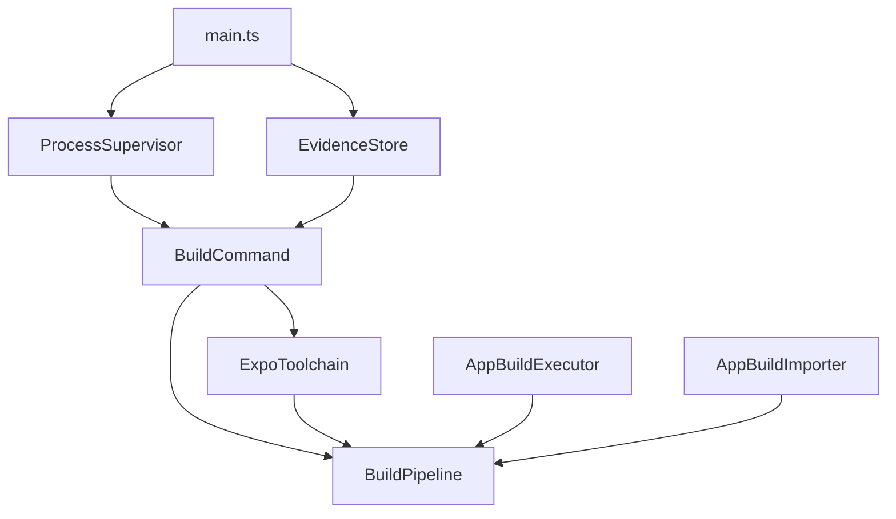
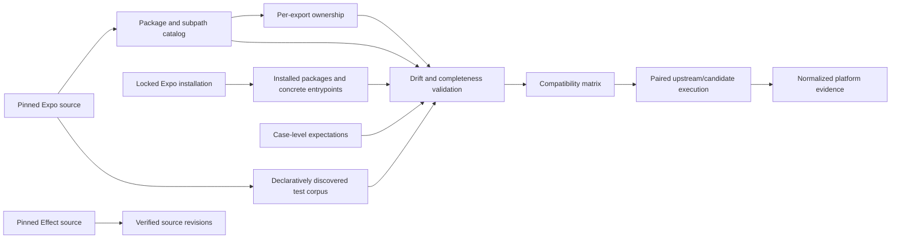
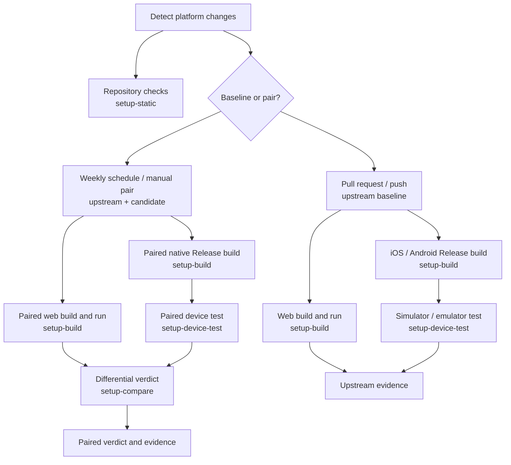

# better-native architecture

## Product contract

better-native exposes two interfaces over the same installed Expo native packages:

```ts
// Existing Expo application code remains valid.
import * as Network from "expo-network"

// Developers may opt into typed Effect services and failures.
import { Network } from "@better-native/network"
```

Candidate mode changes selected JavaScript resolution through Metro. It does not replace Expo autolinking, config plugins, CocoaPods, Gradle, Expo Modules, or EAS tooling.

## Authoritative target

The exact revision in `vendor/expo` is the authoritative Expo target. Its package manifests, exports, source behavior, tests, native registration, and build tooling define the compatibility contract even when a registry package reports the same semantic version.

Published Expo packages are comparison evidence only. They never redefine or fill gaps in an Expo-owned target surface. Installed registry manifests define target entrypoints only for bundled third-party packages that are absent from the pinned Expo workspace.

## Compatibility contract

Compatibility covers:

- package and subpath resolution;
- runtime and type exports;
- synchronous throws and Promise failures;
- values, error codes, callbacks, subscriptions, hooks, and cleanup;
- module initialization and side effects;
- config plugins and native registration;
- web, iOS, Android, foreground, background, and headless behavior.

The implementation may be incomplete. The compatibility denominator may not be incomplete. Every known export has an ownership state:

- `effect`: implemented by better-native;
- `upstream`: delegated to the pinned Expo implementation;
- `fallback`: better-native attempts an implementation and deliberately falls back;
- `unsupported`: known and unavailable;
- `intentional-divergence`: behavior differs under an explicit reviewed contract.

Only `effect` counts as migrated.

## Repository boundaries

```text
apps/compatibility-suite       Executable Expo application and live vectors
packages/*                     Publishable better-native packages
tooling/compatibility-harness  Private Expo catalog and installation-validation CLI
packages/typescript-config     Private shared TypeScript presets
compatibility/ownership.json   Reviewed per-export ownership overrides
compatibility/surface-lock.json Reviewed lock for the complete discovered export denominator
compatibility/expectations.json Case-level known upstream or candidate behavior
compatibility/suites.json      Declarative upstream test discovery rules
vendor/effect                  Pinned Effect source
vendor/expo                    Pinned Expo source and behavioral oracle
.artifacts                     Disposable catalogs, reports, builds, logs, and screenshots
```

The harness source is divided by responsibility:

```text
src/build       Expo toolchain preparation, isolated CNG workspaces, builds, and product import
src/supervision Scoped processes plus web, simulator, emulator, and external-runner lifecycles
src/evidence    Immutable evidence storage and runtime discovery
src/protocol    Cross-process run protocols
src/comparison  Upstream/candidate differential verdicts
src/runners     Upstream runner adapters
```

`BuildPipeline` now only coordinates prepared toolchains with build execution and product import.
It does not install Expo or own process lifecycle behavior.

### Build service ownership

`main.ts` constructs each shared build service once. `BuildPipeline` receives the shared
`BuildCommand` and `ExpoToolchain` services; it never creates another materialization path. This
makes the pinned Expo installation a real dependency-graph invariant.



External runner plans are executable-code manifests, not untrusted data. Every plan is reviewed
like source code, declares `"reviewed": true`, remains inside the repository, and uses only the
narrow command set associated with its runner. The supervisor confines working directories and
reports to real, non-symlinked repository paths and bounds report ingestion. Reports may only be
written beneath `.artifacts/runs/<run-id>/external`; no plan can replace or remove repository
source files.
`RunnerPlanLedger.json` gives every non-app corpus source either a concrete runner command or an
explicit blocker, so an unsupported runner never disappears from the compatibility denominator.
Jest source classification records AST-derived static, dynamic, or absent case evidence. Sources
without declaration evidence fail closed as support inputs; dynamic declarations remain executable
and are closed by observed runner cases rather than invented static identifiers.

Publishable packages do not import harness code. The harness may inspect public package exports and pinned vendor sources. `bun run generate` recreates disposable catalog artifacts under `.artifacts`.

Knip enforces workspace file and dependency boundaries through `bun run check`. Unused exports and exported types remain disabled while the harness protocols are being built. The compatibility application's complete Expo SDK dependency set is validated by `ExpoInstallation`, so Knip does not treat intentionally dormant SDK packages as ordinary unused dependencies.

## Harness data flow



## Checked-in truth versus artifacts

The following are deterministic and reviewed in version control:

- pinned revisions;
- suite discovery rules;
- ownership overrides;
- the reviewed export-surface lock;
- expectations and upstream overlays;
- harness schemas and code.

Build products, test reports, logs, screenshots, and simulator state belong under `.artifacts` and
are not committed. The repository root owns only its own Turbo configuration through `turbo.json`.
Pinned Expo is materialized by the harness with Expo's normal `pnpm install --frozen-lockfile`
lifecycle. The harness does not suppress lifecycle scripts, curate a replacement rebuild list, or
inject a Turbo endpoint into `vendor/expo`. This is the same runnable-workspace model used by
Expo's test-suite workflows. Compatibility build services consume that one verified
materialization and create separate upstream and candidate CNG workspaces only when a differential
run is requested.

Root checks may use this repository's signed remote Turbo cache when credentials are configured.
Compatibility jobs deliberately do not pass those credentials to pinned Expo. Missing cache
credentials affect speed only, never correctness.

## Hosted execution

Compatibility execution is hosted by GitHub Actions. Developer machines are not the default native
build or device-test environment. Its topology is adapted directly from Expo:



`setup-static`, `setup-build`, `setup-device-test`, and `setup-compare` are explicit job profiles.
Only the build profile installs Node and pnpm and materializes pinned Expo. Device jobs consume
immutable products; comparison jobs consume downloaded evidence and never install Expo or generate
the catalog. Pull requests and pushes run the upstream baseline for affected platforms. The weekly
schedule and manual `pair` mode run upstream and candidate through the same build and device paths;
candidate mode changes only Metro resolution. Differential verdicts are emitted in their own
lightweight jobs.

The copied Expo primitives retain platform change classification, ccache configuration, Gradle and
React Native download cache boundaries, Xcode-version invalidation, runner cleanup, and the pinned
Maestro versions. Release products and successful evidence are retained for three days; failures
are retained for seven. Native fingerprinting, repacking, reusable native shells, and timing-based
sharding are intentionally outside this baseline. They may only be introduced after paired runs are
stable and each has a dedicated invariant and fault-injection test.

## Validation rules

- All compatibility configuration carries the pinned Expo revision.
- Upstream is the derived default owner; only reviewed ownership exceptions are stored.
- Bundled third-party Expo modules remain in the denominator.
- Unknown package and subpath ownership overrides fail validation.
- Expectations have unique case/platform keys and include a reason and issue.
- Raw upstream failures remain visible; they are not candidate passes.
- Development bundles are diagnostic evidence. Release builds provide native acceptance evidence.

## Current boundary

The repository derives a manifest-resolution catalog and an indexed test corpus from pinned source. The catalog separates runtime, build-time, server, metadata, and asset entrypoints, preserves conditional and fallback resolution branches, decodes native-registration metadata, and derives package roles from explicit upstream evidence.

`ExpoInstallation` validates the complete SDK dependency map declared by the compatibility app against `bun.lock` and the installed package manifests. It records expected, declared, resolved, and installed versions and preserves integrity information. Pinned manifests and tracked files define Expo-owned target entrypoints and wildcard expansion. Installed manifests and files define target entrypoints only for bundled external packages absent from the pinned workspace. Registry installations are retained separately for toolchain validation and comparison, and a different published package revision remains explicit non-blocking evidence instead of being treated as equivalent to the pinned target.

Static declaration extraction builds the current export denominator from those concrete target entrypoints. Every discovered export is present in the generated ownership ledger, with `upstream` filled explicitly when no reviewed override exists. `compatibility/surface-lock.json` makes additions, removals, and extraction drift reviewable instead of silently changing the denominator.

Static extraction is deliberately honest about uncertainty: entrypoints whose named exports cannot be established are recorded as `opaque-module`. Platform-conditioned Metro resolution and exports that require runtime discovery remain unresolved until the paired resolver records observations. Likewise, the corpus records statically identifiable JavaScript and TypeScript cases now, while native and dynamically generated case identifiers require their runner adapters.

The paired resolver is implemented in `@better-native/metro`. One Expo application can select `upstream` or `candidate` mode without uninstalling or modifying its native Expo packages. Exact candidate mappings, self-import bypass, configuration validation, and resolution observations are Effect services. Metro requires `resolveRequest` to synchronously return a resolution, so `withBetterNative` is the reviewed synchronous runner boundary; it delegates to an existing resolver or `context.resolveRequest` and preserves the original Metro result or failure. The caller supplies run and build identities, and the mode is also supplied to Metro as a custom resolver option so it participates in graph identity. Paired production builds run in isolated processes. The web and native supervisors validate protocol closure, preserve bounded process evidence, and persist normalized run records for differential comparison.

The compatibility suite is a production-bundleable Expo Router application generated from the complete test corpus. Every source is represented as app-runnable or explicitly external; platform loaders statically import eligible pinned Expo Jasmine modules, and background-task registrations are emitted as eager module-scope imports. Selected static cases and explicitly reported runtime discoveries run by stable catalog ID through one application `ManagedRuntime`, with build identity decoded from Expo configuration and Schema-validated result summaries emitted to the UI and console. Upstream and candidate web exports are separate Metro graphs. Native supervisors own launch, timeout, bounded retry, crash detection, result extraction, and evidence persistence; simulator and emulator jobs remain the live conformance boundary.

## Dependency security policy

`bun run security:audit` rejects every new moderate-or-higher advisory. Its reviewed exceptions cover only these exact vulnerable dependency trees pulled in by packages that are intentionally present in the pinned Expo compatibility denominator:

| Owner in the pinned denominator                     | Vulnerable dependency                 | Reviewed advisories                                                                                               |
| --------------------------------------------------- | ------------------------------------- | ----------------------------------------------------------------------------------------------------------------- |
| `expo-app-auth@11.1.1`                              | `@xmldom/xmldom@0.7.13`               | `GHSA-wh4c-j3r5-mjhp`, `GHSA-2v35-w6hq-6mfw`, `GHSA-f6ww-3ggp-fr8h`, `GHSA-x6wf-f3px-wcqx`, `GHSA-j759-j44w-7fr8` |
| `expo-app-auth@11.1.1`                              | `xml2js@0.4.23`                       | `GHSA-776f-qx25-q3cc`                                                                                             |
| `react-native-bootsplash@6.3.12`                    | `sharp@0.32.6`                        | `GHSA-f88m-g3jw-g9cj`                                                                                             |
| `@react-native-community/cli-config-android@18.0.1` | `fast-xml-parser@4.5.7`               | `GHSA-gh4j-gqv2-49f6`                                                                                             |
| `sentry-expo@7.0.1`                                 | `@sentry/browser@7.52.0` and `7.52.1` | `GHSA-593m-55hh-j8gv`                                                                                             |
| Expo's `xcode@3.0.1` tool                           | `uuid@7.0.3`                          | `GHSA-w5hq-g745-h8pq`                                                                                             |

The installed modern trees are already patched where their dependency ranges permit it. Overriding the remaining incompatible major versions would stop the harness from testing the authoritative Expo installation. These exceptions apply only to the private compatibility application and its build tooling; they are not permitted in publishable `@better-native/*` runtime packages. Each ignored advisory must be removed when its owning Expo package leaves the pinned denominator or accepts a patched dependency. The raw `bun audit` report remains the review source; the checked command ensures an unreviewed advisory cannot silently join the exception set.
