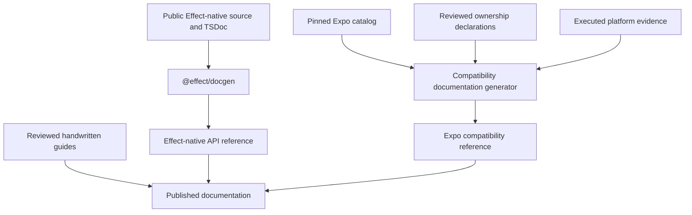

# Documentation architecture

## Target

better-native uses an Effect-first documentation model augmented by generated Expo compatibility evidence.

The documentation must let a developer answer two different questions:

1. How do I use the Effect-native API correctly?
2. How closely does better-native preserve a particular Expo package, export, and platform behavior?

Those questions have different sources of truth and must not be collapsed into one generator.

## Documentation surfaces

| Surface                               | Source of truth                                       | Output                                           |
| ------------------------------------- | ----------------------------------------------------- | ------------------------------------------------ |
| Effect-native API reference           | TSDoc on public TypeScript exports                    | Generated with `@effect/docgen`                  |
| Expo-compatible surface               | Pinned Expo catalog                                   | Generated package, subpath, and export inventory |
| Compatibility status                  | Ownership declarations and executed platform evidence | Generated compatibility reference                |
| Installation and native configuration | Reviewed handwritten documentation                    | Package guides                                   |
| Architecture and contributor policy   | Reviewed handwritten documentation                    | Repository documentation                         |

Generated documentation does not establish compatibility. Only harness evidence may change a platform or behavior claim from unknown to supported.

## Effect-native API reference

Every publishable Effect-native package owns a minimal `docgen.json`. Package configuration should contain only package-specific information such as its source link, internal exclusions, and example compiler environment.

`@better-native/metro` is currently private compatibility infrastructure. Its source-level exports are not yet a supported public API, so its docgen configuration and public TSDoc gate are intentionally deferred. Removing `"private": true` from that package requires adding its `docgen.json`, completing public TSDoc, and including it in the root documentation check in the same change.

Public exports are documented where they are declared. Use the conventions established by Effect:

- `@since` for the release that introduced the API;
- `@category` for stable API grouping;
- `@example` for representative, compilable usage;
- `@internal` for implementation details that must not enter the public reference;
- `@deprecated` with a migration direction when an API is being removed.

Examples must compile with strict TypeScript and the Effect language service. Effect-returning examples should demonstrate composition and leave execution to an explicit application or CLI boundary.

Generated package Markdown is disposable output. Source TSDoc remains canonical and generated output should not be edited manually.

## Expo compatibility reference

The compatibility reference is generated from the same data used by the compatibility harness:

- the pinned Expo revision;
- the derived package, subpath, and export catalog;
- reviewed ownership overrides;
- intentional divergences and linked issues;
- platform evidence produced by paired upstream and candidate execution.

It must not introduce a second handwritten package or entrypoint map. When Expo adds, removes, or changes a public entrypoint, catalog drift must be visible to both the harness and documentation.

At minimum, the generated reference reports:

| Field               | Meaning                                                                      |
| ------------------- | ---------------------------------------------------------------------------- |
| Package and subpath | The Expo import being evaluated                                              |
| Export              | The public runtime or type export                                            |
| Ownership           | `effect`, `upstream`, `fallback`, `unsupported`, or `intentional-divergence` |
| Platform            | Web, iOS, Android, or another applicable execution environment               |
| Evidence            | The live vector or differential test supporting the claim                    |
| Upstream revision   | The exact Expo source used as the oracle                                     |
| Reason and issue    | Required context for unsupported or divergent behavior                       |

Unknown and unexecuted states must remain explicit. A successful bundle is diagnostic evidence, not native conformance.

## Evaluation boundary

Documentation is an input to a developer-experience claim, not evidence merely because it exists.
Every DX trial must record the exact instruction, declarations, generated references, and
handwritten guides exposed to the participant or agent. Changing that bundle changes the evaluated
condition and requires a new baseline.

The current deterministic Network, Battery, KeepAwake, and SecureStore tasks expose their
instructions and built public declarations while withholding package source, reference patches,
native doubles, and graders. A versioned generated-reference and handwritten-guide bundle has not
yet been integrated into those tasks. Until it is, the task results test the declared instruction
and public type surface rather than the discoverability of the complete documentation system. Paid
Network and Battery diagnostic runs are recorded; paid KeepAwake and SecureStore execution,
accepted performance baselines, and human blind pilots remain pending, as recorded in
[the evaluation contract](./evals.md).

## Handwritten guides

Generated API documentation does not replace explanations that require product or platform context. Handwritten guides cover:

- installation and Expo toolchain integration;
- config plugins, permissions, and native configuration;
- using an unchanged Expo-compatible import;
- opting into an Effect-native service;
- interoperability and incremental migration;
- lifecycle, background, and platform limitations where applicable.

Do not duplicate Expo's upstream API prose. Link to the applicable upstream documentation and document only better-native behavior, integration, evidence, and intentional differences.

Current package guides:

- [Battery](../packages/battery/README.md)
- [Network](../packages/network/README.md)
- [KeepAwake](../packages/keep-awake/README.md)
- [SecureStore](../packages/secure-store/README.md)
- [private Metro compatibility integration](../packages/metro/README.md)

## Generation flow

## Repository conventions

- Keep one minimal `docgen.json` in each public Effect-native package.
- Run documentation generation from one root command that discovers eligible packages.
- Do not maintain a root script that names every package individually.
- Do not create a custom Expo-style TypeDoc renderer unless the published documentation demonstrably requires it.
- Do not commit large generated API trees by default.
- Keep compact compatibility truth in version control and disposable rendered output under `.artifacts` or the documentation build output.
- Fail CI when public TSDoc cannot be parsed, examples do not typecheck, compatibility documentation is stale, or generated claims disagree with harness data.

## Deferred decisions

The following choices should be made when a documentation site is introduced, not encoded prematurely:

- the site generator and hosting provider;
- whether generated API Markdown is published directly or transformed;
- structured rendering for Expo-style platform annotations;
- documentation versioning for better-native releases;
- whether generated compatibility snapshots should be committed for release tags.

These decisions may change presentation, but they must not change the sources of truth defined above.
